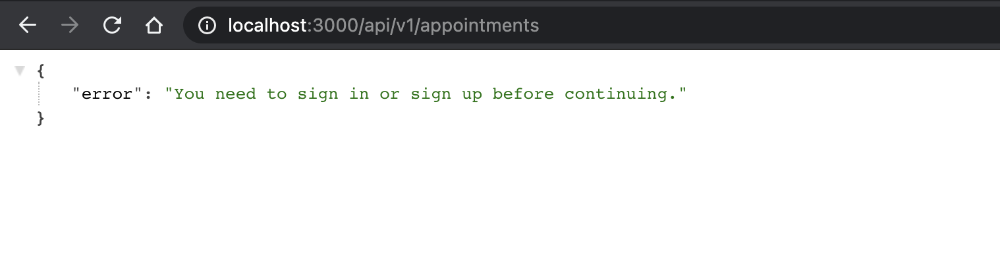
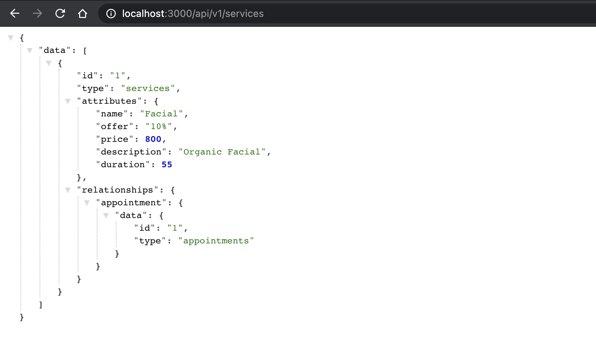

# Encapture API (Final Capstone Booking Appointments)

> Built backend in Ruby on Rails for final capstone project. For this project I have created a web app for booking an appointment for salon services.

- Using namespace and versioning for all the routes
- Using api authentication with json web tokens
- Using Active Model Serializers with josn_api adapter for json data for consistency
- User without login can access the `services` end point
- Only logged in user can access the `appointments` end point and see their own appointments
- Using factory bot for creating a mock user

## Screenshots

- 
- 

## API Endpoints

- `api/v1/auth/signin` (post)
- `api/v1/auth/signup` (post)
- `api/v1/appointments` (get, post)
- `api/v1/services` (get)

## Built With

- Ruby
- Ruby on Rails
- Postgresql
- JWT (Json Web Token)
- Devise
- Active Model Serializers
- Factory Bot
- Rspec
- Capybara
- rubocop
- heroku

## Live Demo

[Encapture Backend]()

### Prerequisites

- Ruby

- Rails

- Postgresql

## Getting Started

To get a local copy up and running follow these simple steps:

**Setup**

- Clone this repository with git clone `git@github.com:Amita-Roy/Encapture-API.git` using your terminal or command line.<br>
- Change to the project directory by entering `cd encapture-api` in the terminal<br>
- Next run `bundle install` to install the necessary dependencies<br>
- run rails `active_storage:install`
- run `rails db:create`
- Run `rails db:migrate` to setup your local database.<br>
- Run `rails db:seed` to get seeded data for project.<br>
- Finally run `rails server` to start the application.<br>

### Usage

Start server with:

```
    rails server
```

Open `http://localhost:3000/` in your browser.

### Run tests

> for test formatting add below script in .rspec file

```
    rpsec --format documentation
```

> To run all the tests run below script in the terminal

`rspec`

## Author

👤 **Amita Roy**

- Amita Roy: [Portfolio](https://amitaroy.com/)
- Github: [@Amita](https://github.com/Amita-Roy)
- Twitter: [@Amita](https://twitter.com/AmitaRoy14)
- Linkedin: [@Amita](https://www.linkedin.com/in/amita-roy/)

## 🤝 Contributing

Contributions, issues and feature requests are welcome!

## Show your support

Give a ⭐️ if you like this project!

## 📝 License
